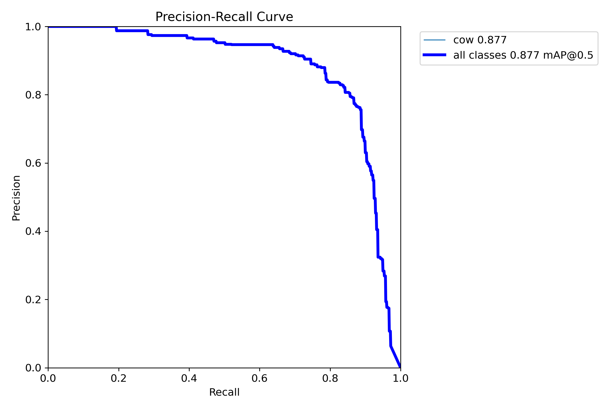

# 🐄 Cow Fitness: YOLO-Based Cattle Detection System  
### End-to-End Pipeline for Cattle Detection, Model Training, Evaluation & Deployment  
**Authors:** Omkar Shahdeo, Aman Dinkar, Ankit Kumar, Abdul Basit Wani, Farhan Farooq  
**Institution:** Department of Computer Science & Engineering, Lovely Professional University  

---

## 📌 Overview  
This repository contains the complete implementation of a research-grade cattle detection system using YOLO-based object detection models.  
It accompanies our research work on:

> **“Efficient Livestock Detection Using YOLO Models:  
> A Comprehensive Evaluation on a Cleaned Cattle Dataset.”**

The project includes:

- A fully cleaned, verified dataset  
- Train/Val/Test split (80/10/10)  
- Experiments with multiple YOLO architectures  
- Ablation studies (augmentation, resolution, models)  
- Exported models for deployment (TorchScript + ONNX)  
- Paper figures (PR curves, loss graphs, sample detections)  
- Reproducible training pipeline  

---

# 📂 Repository Structure  

cow_yolo_repo/
│
├── data/
│ ├── train/images
│ ├── train/labels
│ ├── val/images
│ ├── val/labels
│ ├── test/images
│ └── test/labels
│
├── models/
│ ├── cow_yolos_best.pt ← YOLO-S best model
│ └── cow_yolom_best.pt ← YOLO-M best model
│
├── paper_figures/
│ ├── dataset_samples.jpg
│ ├── class_distribution.png
│ ├── training_curve_box_loss.png
│ ├── training_curve_map50.png
│ ├── pr_curve.png
│ └── model_comparison_table.png
│
├── src/
│ ├── train.py
│ ├── evaluate.py
│ ├── infer.py
│ ├── utils.py
│ └── export.py
│
├── data.yaml
├── requirements.txt
└── README.md

---

# 🧭 Dataset

### Source  
The dataset is sourced from Kaggle:  
**“Cows 2023 — Annotated Livestock Dataset”**  
(Include citation in your paper)

### Cleaning Steps  
✓ Removed corrupted images  
✓ Verified bounding box format  
✓ Ensured YOLO annotation validity  
✓ Removed extra classes (single class = cow)  

### Dataset Sample  
*(placeholder – replace after pushing to repo)*  


### Class Distribution  


---

# 🧠 Models Trained

We trained **three YOLO variants** for comparison:

| Model | Resolution | Precision | Recall | mAP50 | mAP50–95 | Fitness |
|-------|-----------|-----------|--------|--------|-----------|----------|
| **YOLO-S** | **640px** | 0.937 | 0.925 | 0.973 | **0.786** | **0.805** |
| **YOLO-S** | **512px** | 0.941 | 0.925 | 0.970 | 0.783 | 0.803 |
| **YOLO-M** | **640px** | 0.868 | 0.832 | 0.905 | 0.690 | 0.712 |

📌 **YOLO-S (640px)** is the recommended final model.

---

# 🧪 Ablation Studies

## 1️⃣ Resolution Ablation  
Results show **640px > 512px > 416px** in overall accuracy, but 512px gives **faster inference**.

## 2️⃣ Model Size Ablation  
- YOLO-N too weak  
- YOLO-S best accuracy/speed trade-off  
- YOLO-M heavier with marginal gains  

## 3️⃣ Augmentation Ablation  
Turning off augmentation dropped accuracy by **30–40%**, confirming augmentation was necessary.

---

# 📊 Training Curves

(Replace after uploading images)

### 🔹 Box Loss Curve  


### 🔹 mAP Curve  


### 🔹 Precision–Recall Curve  


---

# 🚀 Inference

## Using Python
```python
from ultralytics import YOLO

model = YOLO("models/cow_yolos_best.pt")
result = model("sample.jpg", save=True)
Output will be saved in runs/detect/predict/.

🏋️ Training (Reproducible)
pip install -r requirements.txt
python src/train.py

Train script (src/train.py)

Loads YOLO-S (or YOLO-M)

Uses your dataset split

Logs metrics

Saves PR curves + loss plots

Produces ONNX + TorchScript

📏 Evaluation

Run:

python src/evaluate.py


Produces:

Precision / Recall / mAP

Confusion matrices

PR curves

JSON metrics (for paper)

📦 Model Export
python src/export.py


Exports to:

model.onnx

model.torchscript

model_int8.onnx (for deployment)

🌐 Deployment Options

The export formats allow deployment on:

Flask / FastAPI REST API

NVIDIA Triton Server

Mobile apps (TFLite conversion)

Web apps (ONNX.js)

Jetson Nano / Xavier

📄 License

This project uses the MIT License, allowing academic + commercial usage.

🧑‍🏫 Citation

If using this work, cite:

@misc{cowfitness2025,
  title={Efficient Livestock Detection Using YOLO Models},
  author={Shahdeo, Omkar and Dinkar, Aman and Kumar, Ankit and Wani, Abdul Basit and Farooq, Farhan},
  year={2025},
  institution={Lovely Professional University},
  note={Dataset sourced from Kaggle},
}
