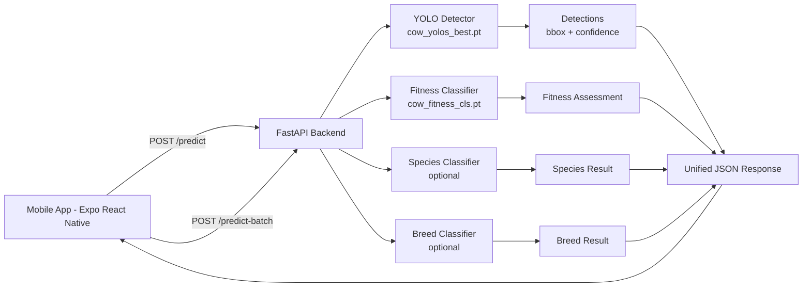

# Cow Fitness YOLO Project

An end-to-end computer vision project for livestock analysis, combining:

- A FastAPI backend for detection and classification
- A React Native (Expo) mobile frontend for capture and visualization
- YOLO-based models for detection and fitness assessment

This repository is organized for clear separation of concerns:

- backend: APIs, inference, training scripts, datasets
- frontend: mobile application
- models: base and trained model artifacts

## 1) What This Project Does

Given one or more cattle images, the system can:

- Detect animals and return bounding boxes
- Estimate fitness condition (good, average, bad)
- Predict species (cow, buffalo, other, unknown)
- Predict breed (when species is cow and breed model is available)
- Return batch summary statistics for multiple images

## 2) Repository Structure

```text
cow_fitness_yolo/
├── backend/
│   ├── src/
│   │   ├── api.py
│   │   ├── infer.py
│   │   ├── infer_fitness_classifier.py
│   │   ├── train.py
│   │   ├── train_fitness_classifier.py
│   │   ├── train_species_classifier.py
│   │   ├── train_breed_classifier.py
│   │   └── bootstrap_fitness_dataset.py
│   ├── data/
│   ├── data_fitness/
│   ├── data_species/
│   ├── data_breed/
│   ├── requirements.txt
│   └── README.md
├── frontend/
│   ├── cowFitnessApp/
│   │   ├── App.js
│   │   ├── package.json
│   │   └── src/screens/
│   │       ├── HomeScreen.js
│   │       ├── CaptureScreen.js
│   │       ├── ResultsScreen.js
│   │       └── HistoryScreen.js
│   └── MOBILE_APP_SETUP.md
├── models/
│   ├── trained/
│   │   ├── cow_yolos_best.pt
│   │   └── cow_fitness_cls.pt
│   ├── yolo11n.pt
│   ├── yolo11n-cls.pt
│   ├── yolov8s.pt
│   └── yolov8m.pt
├── .venv/
├── .gitignore
├── LICENSE
└── README.md
```

## 3) System Architecture



## 4) Frontend Overview

Location: frontend/cowFitnessApp

Main app responsibilities:

- Select image from gallery
- Capture image from camera
- Select multiple images for batch processing
- Call backend API endpoints
- Overlay detection boxes on image preview
- Show species, breed, and fitness summaries
- Keep local in-memory history of detections

Core screen flow:

- HomeScreen: entry and navigation
- CaptureScreen: backend URL + image input actions
- ResultsScreen: bounding boxes, confidence, summaries
- HistoryScreen: previously processed items

Backend URL behavior in app:

- Defaults to current Expo host with port 8010
- Can be edited in Capture screen

## 5) Backend Overview

Location: backend/src

API server:

- Framework: FastAPI
- Model runtime: Ultralytics YOLO
- Endpoints:
  - GET /health
  - GET /model-status
  - POST /predict
  - POST /predict-batch

Inference pipeline:

1. Load detector model (required)
2. Run object detection and extract boxes
3. Run optional fitness classifier
4. Run optional species classifier with detector fallback
5. Run optional breed classifier if species is cow
6. Return consolidated response JSON

Model loading logic in backend:

- Uses environment variables when provided
- Otherwise resolves to models/trained first
- Falls back to models root legacy paths

## 6) Models

Location: models

Currently available in this repository:

- Detection model:
  - models/trained/cow_yolos_best.pt
- Fitness classifier:
  - models/trained/cow_fitness_cls.pt
- Base models (for additional training/experiments):
  - models/yolo11n.pt
  - models/yolo11n-cls.pt
  - models/yolov8s.pt
  - models/yolov8m.pt

Optional models (if you add them):

- models/trained/cattle_species_cls.pt
- models/trained/cow_breed_cls.pt

## 7) Quick Start

### Prerequisites

- Python 3.10+
- Node.js 18+
- npm
- Expo CLI runtime via npm scripts

### 7.1 Start Backend

From repository root:

```bash
F:/Cow/cow_fitness_yolo/.venv/Scripts/python.exe -m uvicorn backend.src.api:app --host 0.0.0.0 --port 8010 --reload
```

Health check:

```bash
curl http://localhost:8010/health
```

### 7.2 Start Frontend

From repository root:

```bash
cd frontend/cowFitnessApp
npm install
npm start
```

If your backend runs on a different host/port, update the Backend URL in Capture screen.

## 8) API Response Shape

Predict endpoint returns data in this form:

```json
{
  "detections": [
    {
      "class_id": 0,
      "class_name": "cow",
      "confidence": 0.93,
      "bbox": {
        "x1": 12.3,
        "y1": 18.1,
        "x2": 256.2,
        "y2": 301.6
      }
    }
  ],
  "assessment": {
    "status": "good",
    "score": 86,
    "summary": "Classifier indicates good fitness condition.",
    "note": "Model-based estimate only; veterinary validation is recommended.",
    "source": "classifier",
    "confidence": 0.91
  },
  "species": {
    "label": "cow",
    "confidence": 0.88,
    "source": "classifier"
  },
  "breed": {
    "label": "unknown",
    "confidence": 0.0,
    "source": "unavailable"
  }
}
```

## 9) Training and Data

Training scripts live in backend/src:

- train.py: detector training
- train_fitness_classifier.py: good/average/bad classifier
- train_species_classifier.py: species classifier
- train_breed_classifier.py: breed classifier

Dataset roots in this repository:

- backend/data
- backend/data_fitness
- backend/data_species
- backend/data_breed

Example (fitness classifier):

```bash
F:/Cow/cow_fitness_yolo/.venv/Scripts/python.exe backend/src/train_fitness_classifier.py --data backend/data_fitness --epochs 50 --imgsz 224 --batch 16
```

## 10) Environment Variables for Model Overrides

You can override model paths at runtime:

- DETECTOR_MODEL_PATH
- FITNESS_MODEL_PATH
- SPECIES_MODEL_PATH
- BREED_MODEL_PATH

Example:

```bash
set DETECTOR_MODEL_PATH=F:/path/to/custom_detector.pt
set FITNESS_MODEL_PATH=F:/path/to/custom_fitness.pt
F:/Cow/cow_fitness_yolo/.venv/Scripts/python.exe -m uvicorn backend.src.api:app --host 0.0.0.0 --port 8010 --reload
```

## 11) Notes

- Fitness outputs are model-based estimates and not veterinary diagnosis.
- Species and breed depend on optional classifier availability.
- For mobile testing on a physical device, use your machine LAN IP in app backend URL.

## 12) License

This project is licensed under the MIT License. See LICENSE for details.
